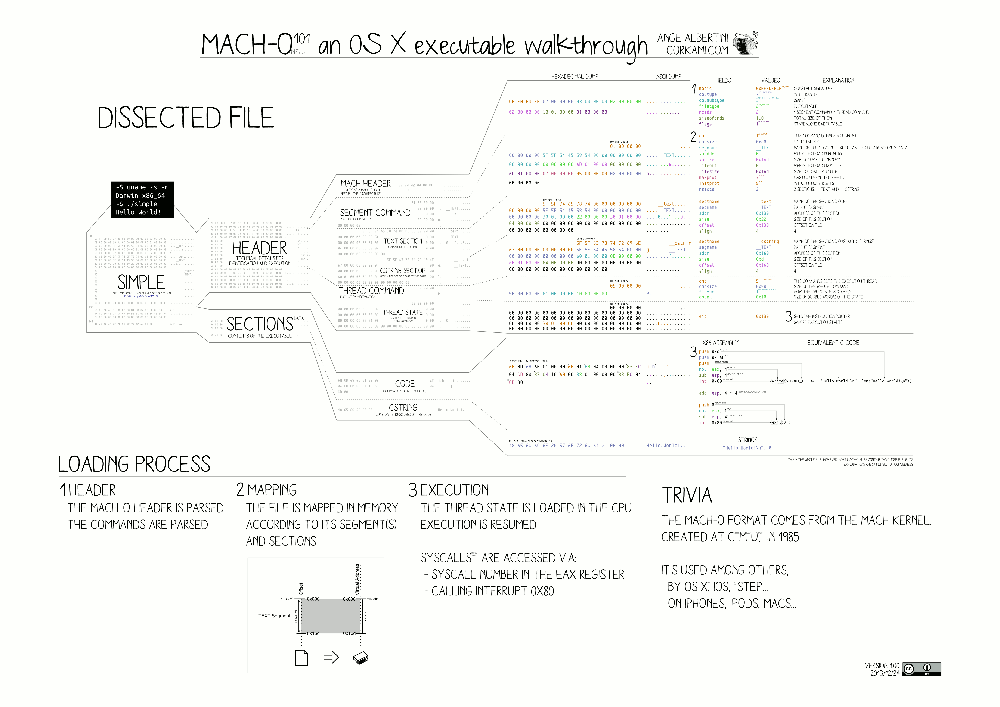
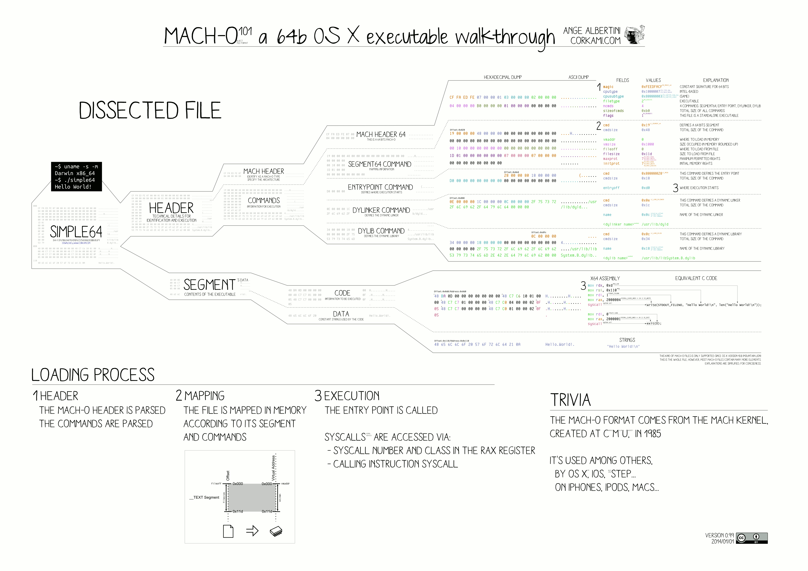

# NM - OTOOL

> Ce qui se trouve ici __n'est pas nécessairement vrai__. Ce sont juste les avancées de ma compréhension dans le sujet.

## Comment ça marche ?

Le compilateur va générer un certains nombres de tables pour permettre une exécution plus facile. Il décompose l'exécutable en _segments_, eux-mêmes décomposés en _sections_.

Les _segments_ permettent de définir un certains nombres de droit d'accès. Par exemple :

- `__TEXT` est en `READ_ONLY`
- `__DATA` est en `READ` et `WRITE`

Les _sections_ correspondent ensuite à des bouts de l'exécutable.

## Illustrations

Deux images illustrants très bien l'architecture des fichiers binaires _Mach-o_ :

[Source](https://imgur.com/a/bwIKM#11)
